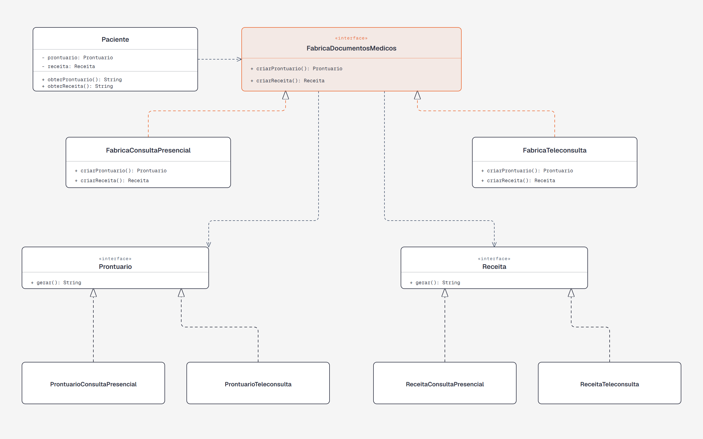

# DCC078 - Padrões de Projeto: Abstract Factory

**Aluno:** Felipe Lazzarini Cunha

## Tema

O projeto representa a geração de documentos médicos para dois tipos de atendimento:

- Consulta presencial
- Teleconsulta

Cada modalidade gera uma família de documentos compatíveis: prontuário e receita.

## Diagrama de Classes UML



## Estrutura do Projeto

- `Prontuario` e `Receita`: interfaces dos produtos abstratos.
- `ProntuarioConsultaPresencial` e `ReceitaConsultaPresencial`: produtos para atendimento presencial.
- `ProntuarioTeleconsulta` e `ReceitaTeleconsulta`: produtos para teleconsulta.
- `FabricaDocumentosMedicos`: fábrica abstrata que define a criação dos documentos.
- `FabricaConsultaPresencial` e `FabricaTeleconsulta`: fábricas concretas de cada modalidade.
- `Paciente`: cliente que recebe uma fábrica e utiliza os documentos gerados.

## Testes

Os testes verificam a geração de prontuário e receita para as duas modalidades de atendimento.

```bash
mvn test
```
